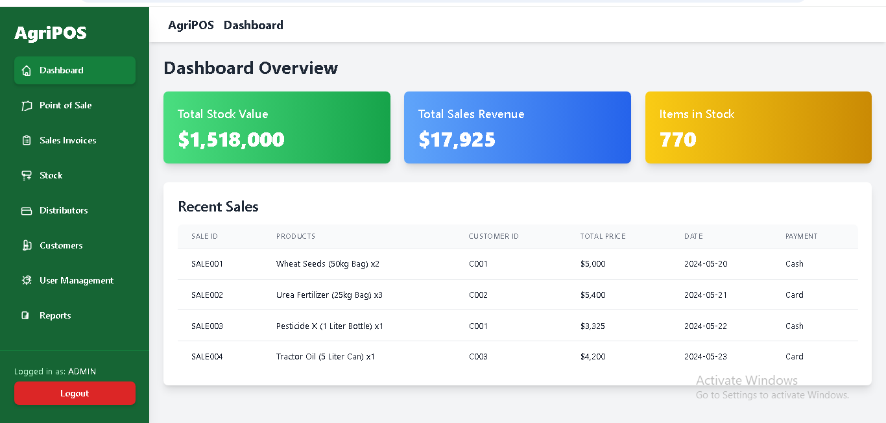

# 🌾 Agri POS System

## 📌 Overview
The **Agri POS System** is a smart Point of Sale solution designed for **agri-stores and farm supply businesses**.  
It streamlines sales, inventory, and customer management while offering real-time reports and simple operations for store owners.

---

## ✨ Features
- 💰 **Sales Management** — Fast billing, invoicing, and receipt printing  
- 📦 **Inventory Control** — Track stock levels, product categories, and supplier details  
- 👥 **Customer Management** — Store customer info and purchase history  
- 📊 **Reports & Analytics** — Generate daily/weekly/monthly sales and inventory reports  
- 🌐 **Cloud-ready** — Deployment on AWS for scalability  
- 📱 **Responsive UI** — Works across desktop, tablet, and mobile  

---

## 🛠️ Tech Stack
- **Framework:** Laravel (PHP)  
- **Frontend:** Blade Templates, Bootstrap  
- **Database:** MySQL  
- **Deployment:** Docker + AWS (EC2/RDS)  
- **Authentication:** Laravel Passport / JWT  

---

## 🖼️ Screenshots

### 1. POS Billing Screen  
  

### 2. Inventory Dashboard  
  

---

## 📦 Deliverables
- Complete POS web application tailored for agri-stores  
- Inventory & sales management modules  
- Customer management with reporting dashboard  
- Cloud deployment with Docker on AWS  
- Documentation (installation + user guide)  

---

## 📈 Outcome
- Simplified **store operations** for agri-businesses  
- Better **stock visibility** to reduce losses  
- Faster and **accurate billing**  
- Improved **decision-making** through reports and analytics  

---

## 🔒 Code Access
The source code is kept **private** for security and intellectual property reasons.  
👉 Clients may request access or receive the code as part of project delivery.

---
