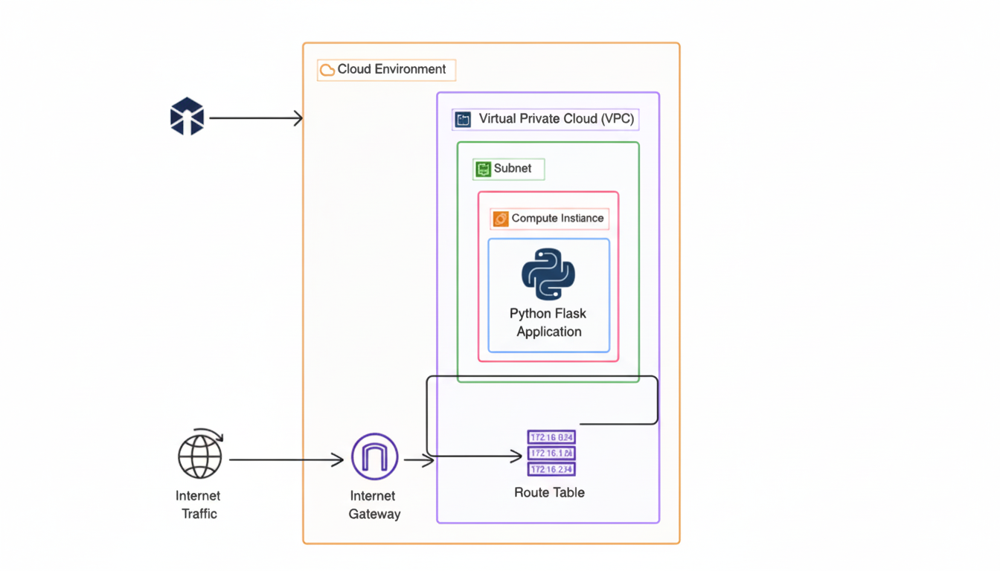

# 🚀 Automated Flask App Deployment on AWS via Terraform Provisioners

## 📌 Overview  
This project demonstrates how to use **Terraform provisioners** to automatically deploy a **Flask web application** onto EC2 instances on AWS.  
It combines Infrastructure as Code (IaC) with application deployment automation, enabling a seamless, end-to-end provisioning and deployment flow.

---

## ✨ Features  
- ✅ Infrastructure as Code: AWS resources (VPC, EC2, Security Groups) defined in Terraform  
- 🤖 Automated app deployment: Using Terraform **provisioners** to install dependencies, copy code, and start services  
- 🧩 Modular design: Clear separation between infrastructure definition and deployment logic  
- 🔐 Security: IAM roles, security groups, and secure configurations  
- 🔄 Flexible & repeatable: Re-run `terraform apply` to provision and deploy reliably  

---

## 🛠️ Tech Stack  
- **Cloud / Infra:** AWS (EC2, VPC, Security Groups, IAM)  
- **IaC & Deployment:** Terraform, Terraform Provisioners  
- **Application:** Flask (Python web app)  
- **Version Control:** Git & GitHub  

---

## 🏗️ Architecture Diagram
  

---

## 📦 Deliverables  
- Terraform scripts for AWS resource provisioning  
- Terraform provisioners to deploy Flask app to EC2  
- Deployment documentation & setup steps  
- Architecture diagram and explanation  

---

## 📈 Outcome / Benefits  
- Simplified deployment process — infrastructure + app deploy in one flow  
- Reduced manual steps & potential human error  
- Reproducible setups: same environment from scratch  
- Clear separation between infrastructure and application layers  

---

## 🔒 Code Access  
The full source code (Terraform modules, Flask source) is **private**.  
👉 Clients can request access under NDA or receive it as part of final delivery.

---
