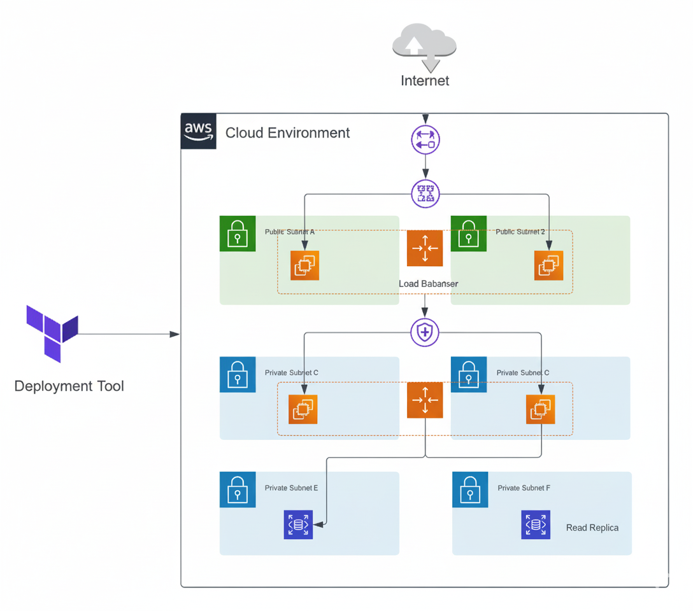

# 🚀 Multi-Tier Architecture on AWS with Terraform

## 📌 Overview
This project demonstrates the deployment of a **secure, scalable, and resilient multi-tier infrastructure** on AWS using Terraform.  
It highlights **Infrastructure as Code (IaC)** best practices, modular design, and automation for real-world cloud environments.

---

## ✨ Features
- ⚡ Automated provisioning of AWS infrastructure with Terraform  
- 🏗️ Multi-tier design: Web, Application, and Database layers  
- 🌍 High availability across multiple Availability Zones  
- 📈 Auto-scaling for dynamic traffic handling  
- 🔒 Hardened security with IAM, security groups, and network segmentation  
- ♻️ Modular Terraform structure for reusability and maintainability  
- ▶️ Single-command infrastructure deployment (`terraform apply`)  

---

## 🛠️ Tech Stack
- **Cloud:** AWS (VPC, EC2, RDS, ELB, IAM, NAT Gateway, Subnets)  
- **IaC Tooling:** Terraform (modular code structure)  
- **Version Control:** GitHub  
- **Automation:** Infrastructure as Code with reusable variables & outputs  

---

## 🏗️ Architecture Diagram
*(Replace with your uploaded diagram image)*  

  

---

## 📦 Deliverables
- ✅ Cloud infrastructure setup (VPC, Subnets, Gateways, IAM, Security)  
- ✅ Multi-tier application environment (Web, App, DB layers)  
- ✅ Modular Terraform code for reusability  
- ✅ Documentation with variables, outputs, and deployment steps  
- ✅ Architecture diagram and explanation  

---

## 📈 Outcome
- Reduced **deployment time** from hours to minutes  
- Achieved **scalability** with auto-scaling groups  
- Improved **security posture** with IAM & network segmentation  
- Delivered a **cost-optimized** cloud environment  

---

## 🔒 Code Access
The full source code is kept **private** for security and intellectual property reasons.  
👉 Clients may request access or receive the code as part of project delivery.

---
