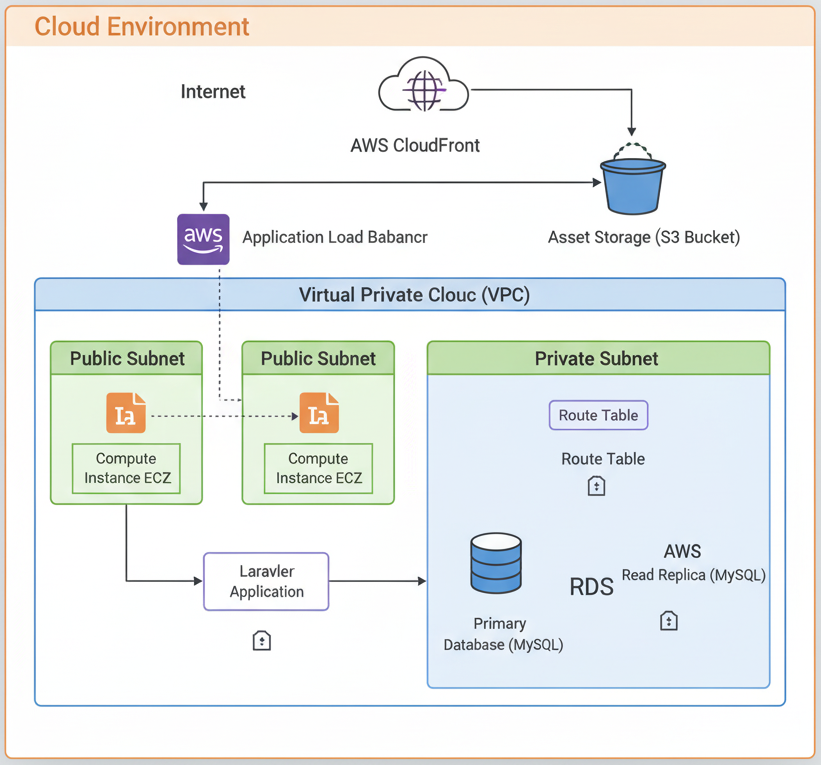

# 📁 Document & Asset Management (DAM) System

## 📌 Overview
The **Document & Asset Management (DAM) System** helps businesses organize, store, and retrieve digital files such as documents, images, and videos.  
It improves workflow efficiency, ensures secure access, and provides an easy way for teams to collaborate and manage their digital assets.

---

## ✨ Features
- 📂 Centralized storage for documents, images, and videos  
- 🔍 Fast search and retrieval with tagging and metadata  
- 👥 Role-based access control (RBAC) for secure file sharing  
- 📊 Activity logs for tracking usage and compliance  
- ☁️ Cloud storage & CDN integration (AWS S3 + CloudFront)  
- 📱 Responsive web interface built with Blade templates  

---

## 🛠️ Tech Stack
- **Framework:** Laravel (PHP)  
- **Frontend:** Blade Templates, Bootstrap  
- **Database:** MySQL  
- **Cloud Storage:** AWS S3  
- **Content Delivery:** AWS CloudFront  
- **Authentication:** Laravel Passport / JWT  

---

## 🖼️ Architecture diagram
  

---

## 📦 Deliverables
- Full-stack Laravel-based DAM web application  
- AWS S3 integration for asset storage  
- AWS CloudFront setup for global delivery & caching  
- Role-based access control (RBAC) with authentication  
- UI/UX design using Blade templates and Bootstrap  
- Documentation (setup + usage guide)  

---

## 📈 Outcome
- Simplified asset management for businesses  
- Reduced **file search and retrieval time**  
- Improved **collaboration and workflow efficiency**  
- Enhanced **security and compliance** with access control and audit logs  
- Faster asset delivery with **CloudFront CDN**  

---

## 🔒 Code Access
The source code is kept **private** for security and intellectual property reasons.  
👉 Clients may request access or receive the code as part of project delivery.

---
